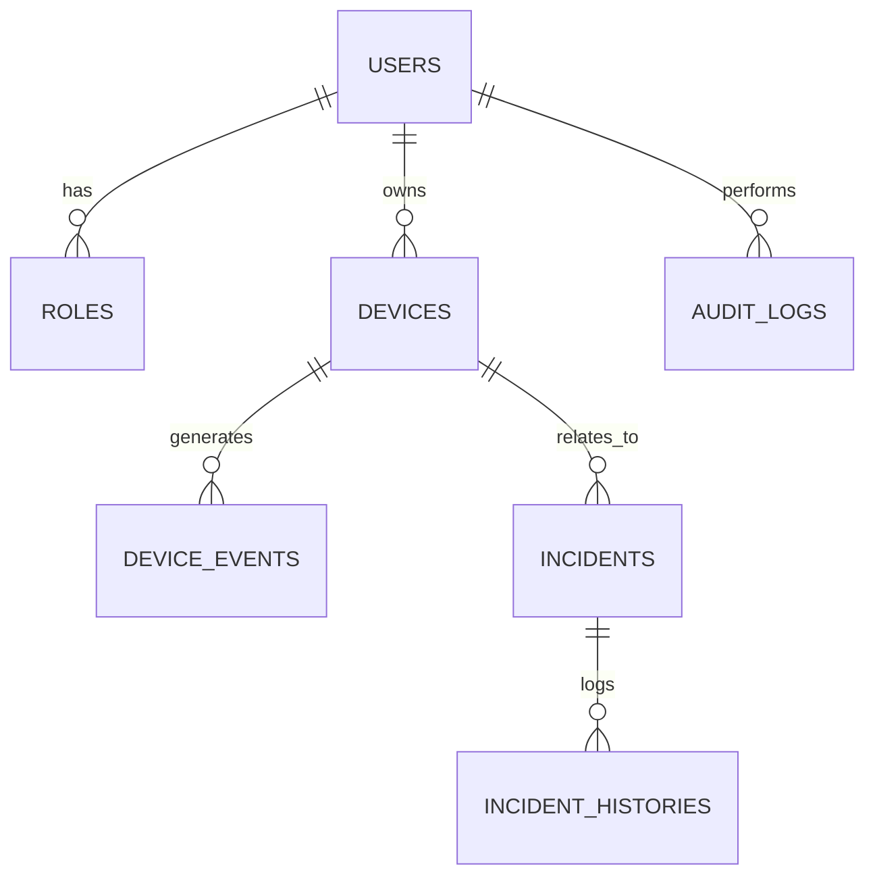

# Softlinkia Security Monitor - Prueba Técnica

Este proyecto es una aplicación web monolítica desarrollada en **Laravel 11** para la gestión de operaciones y monitoreo de eventos de seguridad, realizada como parte de la prueba técnica para **Softlinkia S.A. de C.V.**

## 🚀 Descripción del Proyecto

El sistema permite la gestión de dispositivos de seguridad simulados, el monitoreo de eventos en tiempo real y la gestión automática/manual de incidencias basadas en reglas de negocio. Incluye un control de acceso robusto basado en roles (RBAC) y un panel administrativo para supervisar la operación.

### Requerimientos Implementados ✅
- **Autenticación y RBAC**: Roles para Administrador, Operador y Cliente mediante Spatie.
- **Módulo de Dispositivos**: CRUD reactivo con Livewire y gestión de metadatos JSON.
- **Simulación de Eventos**: Simulación externa vía API POST `/api/simulate-event` e interna vía UI.
- **Gestión de Incidencias**: Automatización (Desconexión -> Incidencia) y creación manual con historial.
- **Dashboard Operativo**: Centro de mando con KPIs vivos, gráficas de flota y filtros globales.
- **Auditoría (Audit Log)**: Bitácora completa de acciones de usuarios y cambios de estado.
- **UX/UI Profesional**: Notificaciones Toasts en tiempo real y diseño Premium con TailwindCSS.

## 🛠️ Stack Tecnológico
- **Framework**: Laravel 11
- **Reactividad**: Livewire 3 (Volt)
- **Styling**: TailwindCSS
- **Base de Datos**: MySQL
- **Paquetes Clave**: Spatie Permission, Laravel Breeze (Volt stack), Sanctum.

## 🛡️ Mejores Prácticas y Seguridad Avanzada
- **Seguridad en Capas**: Implementado `SecurityHeadersMiddleware` para protección contra XSS, Clickjacking y Sniffing.
- **Asincronía (Performance)**: El registro de auditoría se procesa mediante **Jobs en segundo plano** para no penalizar la latencia del usuario.
- **Arquitectura Limpia**: Uso de **Form Objects** para validación y **Observers** para disparar reglas de negocio automáticas.
- **Resiliencia**: Páginas de error (404/500) personalizadas bajo la estética corporativa.

## 📦 Instalación y Despliegue

### Opción A: Con Docker (Recomendado 🐳)
Ideal para evaluación rápida sin instalar dependencias locales.
1. **Clonar el proyecto.**
2. **Copiar el entorno:** `cp .env.example .env`
3. **Levantar contenedores:**
   ```bash
   docker-compose up -d --build
   ```
4. **Instalar dependencias y poblar (dentro del contenedor):**
   ```bash
   docker-compose exec app composer install
   docker-compose exec app php artisan key:generate
   docker-compose exec app php artisan migrate --seed
   ```
El sistema estará disponible en `http://localhost:8000`.

### Opción B: Instalación Manual
1. **Clonar e instalar:**
   ```bash
   git clone https://github.com/Darioantonio20/softlinkia-security-monitor.git
   composer install
   npm install && npm run build
   ```
2. **Configurar BD (MySQL):** Crear base de datos `softlinkia_db` y configurar en `.env`.
3. **Poblamiento:** `php artisan migrate --seed`
4. **Correr:** `php artisan serve` y `npm run dev`.

## 🔐 Accesos de Prueba (Password: `password`)
- **Administrador**: admin@softlinkia.com (Poder total, Bitácora, Borrado)
- **Operador**: operador@softlinkia.com (Gestión activa, sin borrado ni bitácora)
- **Cliente**: cliente@softlinkia.com (Visualización filtrada de sus propios equipos)

## 📊 Arquitectura de Base de Datos


---
*Desarrollado con ❤️ para Softlinkia S.A. de C.V. - Abril 2026*
