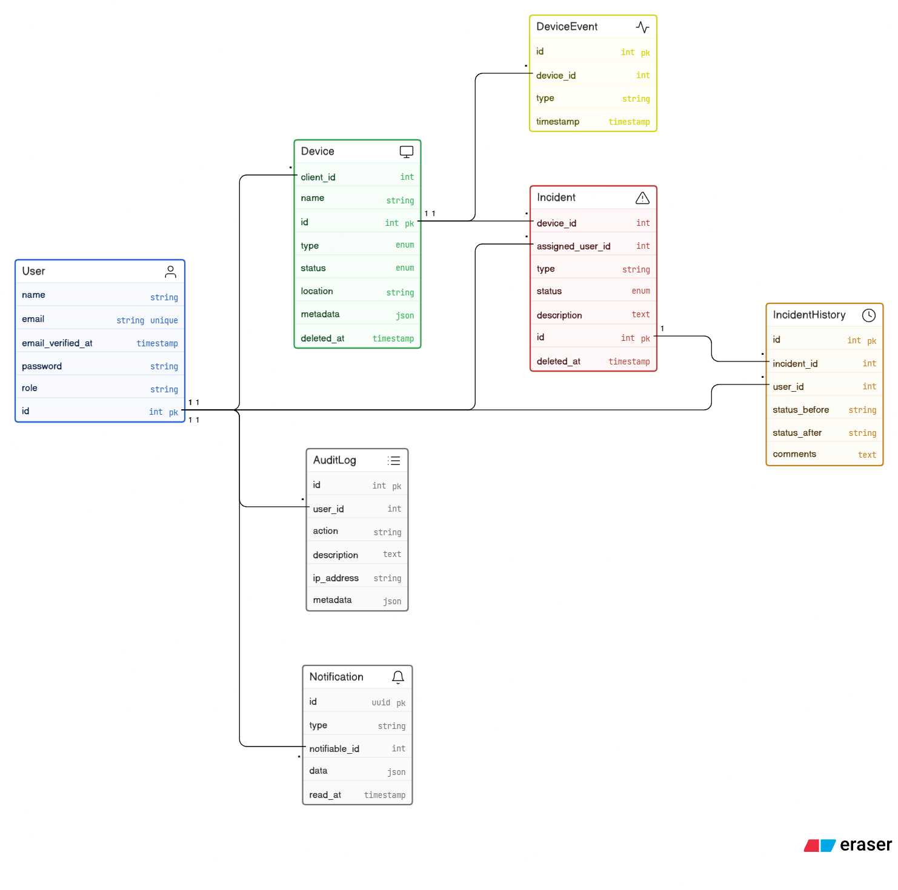

# 🛡️ Softlinkia Security Monitor - Enterprise Solution

[](https://softlinkia-security-monitor-production.up.railway.app/)
[](https://laravel.com)
[](https://livewire.laravel.com)

**Softlinkia Security Monitor** es una plataforma monolítica de vanguardia diseñada para la gestión y monitoreo de activos de seguridad en tiempo real. Este proyecto no solo resuelve la gestión de dispositivos, sino que implementa una arquitectura resiliente y automatizada pensada para entornos corporativos de alta demanda.

🌐 **Demo en Vivo**: [https://softlinkia-security-monitor-production.up.railway.app/](https://softlinkia-security-monitor-production.up.railway.app/)

---

## 🛠️ Stack Tecnológico de Alto Nivel

El proyecto utiliza un stack moderno elegido por su estabilidad, velocidad de desarrollo y escalabilidad:

| Capa | Tecnología | Descripción |
| :--- | :--- | :--- |
| **Núcleo** | **Laravel 11 / PHP 8.2** | Motor robusto con las últimas optimizaciones de rendimiento y seguridad. |
| **Frontend**| **Livewire 3 (Volt)** | Reactividad total sin salir del ecosistema PHP, ofreciendo una experiencia SPA fluida. |
| **Estilo** | **TailwindCSS** | Diseño Premium con efectos de Glassmorphism, Mesh Gradients y micro-animaciones. |
| **Base de Datos** | **MySQL 8.0** | Almacenamiento relacional optimizado con soporte para JSON dinámico. |
| **Tiempo Real** | **Laravel Reverb** | WebSockets nativos para notificaciones instantáneas de seguridad. |
| **Despliegue** | **Docker & Railway** | Infraestructura inmutable con CI/CD automatizado. |

---

## ✨ Características Principales (Features)

### 🖥️ Frontend (UX/UI Premium)
- **Dashboard Operativo Vivo**: Gráficas de tendencias (Chart.js) que se actualizan dinámicamente sin recargar la página.
- **Sistema Global de Notificaciones**: Toasts inteligentes que alertan sobre actividad reciente en cualquier parte de la App.
- **Navegación Fluida**: Interfaz responsiva probada en dispositivos móviles (Nexus 5/iPhone) con navegación optimizada.
- **Reactividad Volt**: Componentes ultrarrápidos para filtrado de dispositivos e incidencias en tiempo real.

### ⚙️ Backend (Arquitectura Robusta)
- **Automatización de Negocio**: Observers inteligentes que generan incidencias automáticamente al detectar desconexiones (Fallo Crítico).
- **Control de Acceso (RBAC)**: Gestión granular de permisos (Admin, Operador, Cliente) mediante Spatie.
- **Bitácora de Auditoría Proactiva**: Middleware dedicado que registra cada acción administrativa en segundo plano (vía Jobs/Queue).
- **Procesamiento Asíncrono**: Uso de colas (Queues) para no bloquear la experiencia del usuario final.
- **Simulación de Eventos**: API REST pública y panel interno para simular alertas de sensores y cámaras.

---

## 🛡️ Seguridad y Calidad Técnica

El proyecto ha sido evaluado bajo los más altos estándares de desarrollo:

- **Security Headers**: Middleware personalizado que inyecta cabeceras de protección activa (CSP, XSS, Clickjacking).
- **Inyección de Dependencias**: Uso estricto de los patrones de Laravel para un código testeable y mantenible.
- **Validación de Datos**: Reglas estrictas y saneamiento de entradas para prevenir inyecciones y ataques comunes.
- **Mapeo de Relaciones**: Estructura de BD normalizada con integridad referencial completa (ver ERD abajo).

---

## 📊 Arquitectura de Base de Datos (ERD)



---

## 🚀 Guía de Instalación

### 🐳 Opción 1: Con Docker (Recomendado)
Para una experiencia "Plug & Play":
1. Clona el repositorio.
2. Crea tu archivo `.env` (`cp .env.example .env`).
3. Ejecuta: `docker-compose up -d --build`.
4. Inicializa el sistema:
   ```bash
   docker-compose exec app php artisan migrate --seed
   ```

### 💻 Opción 2: Instalación Manual (Laragon/XAMPP)
1. Instala dependencias: `composer install` y `npm install`.
2. Configura tu base de datos MySQL en el `.env`.
3. Compila los assets: `npm run build`.
4. Ejecuta las migraciones: `php artisan migrate --seed`.
5. Sirve el proyecto: `php artisan serve`.

---

## 🔐 Credenciales de Acceso (Password: `password`)

- **Administrador**: `admin@softlinkia.com`
- **Operador**: `operador@softlinkia.com`
- **Cliente**: `cliente@softlinkia.com`

---

## 🌎 Pruebas en Producción (Railway)

Si deseas probar el despliegue actual:
1. Accede a la URL de Producción mencionada arriba.
2. Inicia sesión con cualquiera de las credenciales de prueba.
3. Para simular un evento externo, puedes enviar un POST a:
   `https://softlinkia-security-monitor-production.up.railway.app/api/simulate-event`
   (Payload: `{"device_id": 1, "type": "Anomalía detectada"}`)

---
*Este proyecto refleja el compromiso con la excelencia técnica y la innovación constante de Softlinkia S.A. de C.V.*
