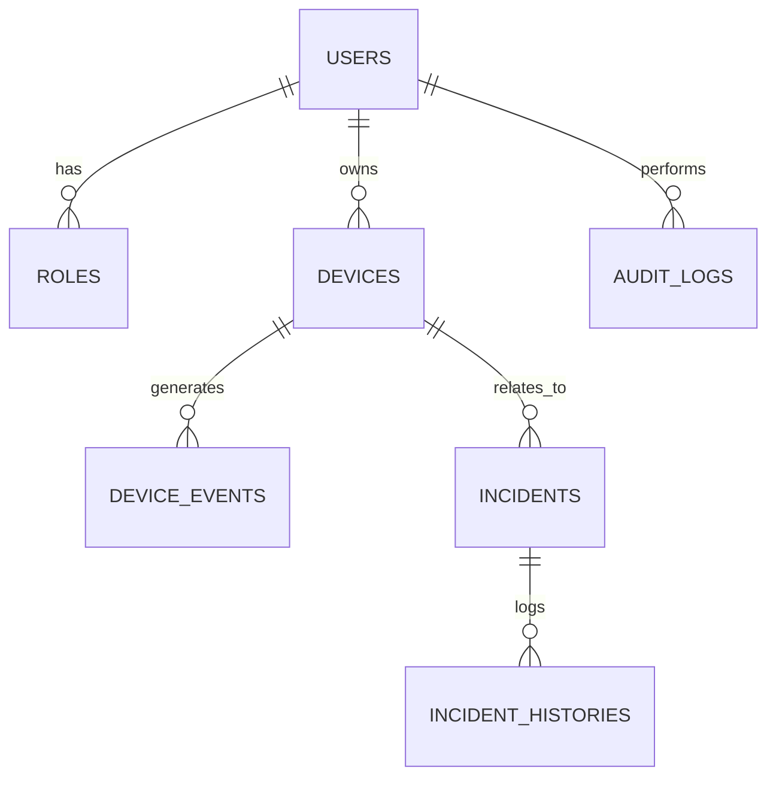

# Softlinkia Security Monitor - Prueba Técnica

Este proyecto es una aplicación web monolítica desarrollada en **Laravel 11** para la gestión de operaciones y monitoreo de eventos de seguridad, realizada como parte de la prueba técnica para **Softlinkia S.A. de C.V.**

## 🚀 Descripción del Proyecto

El sistema permite la gestión de dispositivos de seguridad simulados, el monitoreo de eventos en tiempo real y la gestión automática/manual de incidencias basadas en reglas de negocio. Incluye un control de acceso robusto basado en roles (RBAC) y un panel administrativo para supervisar la operación.

### Requerimientos Implementados ✅
- **Autenticación y RBAC**: Roles para Administrador, Operador y Cliente mediante Spatie.
- **Módulo de Dispositivos**: CRUD reactivo con Livewire y gestión de metadatos JSON.
- **Simulación de Eventos**: Simulación externa vía API POST `/api/simulate-event` e interna vía UI.
- **Gestión de Incidencias**: Automatización (Desconexión -> Incidencia) y creación manual con historial.
- **Dashboard Operativo**: Centro de mando con KPIs vivos, gráficas de flota y filtros globales.
- **Auditoría (Audit Log)**: Bitácora completa de acciones de usuarios y cambios de estado.
- **UX/UI Profesional**: Notificaciones Toasts en tiempo real y diseño Premium con TailwindCSS.

## 🛠️ Stack Tecnológico
- **Framework**: Laravel 11
- **Reactividad**: Livewire 3 (Volt)
- **Styling**: TailwindCSS
- **Base de Datos**: MySQL
- **Paquetes Clave**: Spatie Permission, Laravel Breeze (Volt stack), Sanctum.

## 📋 Decisiones Técnicas y Supuestos
1. **Livewire Volt**: Se eligió la arquitectura funcional de Volt para reducir la dispersión de archivos y mejorar la velocidad de desarrollo en componentes reactivos (Dashboard/CRUDs).
2. **Observers para Automatización**: Se utilizó un `DeviceEventObserver` para desacoplar la lógica de creación de incidencias de los controladores, facilitando la escalabilidad del negocio.
3. **Audit Log Manual**: Se implementó una bitácora personalizada para tener control total sobre los metadatos almacenados, cumpliendo con la exigencia de trazabilidad.
4. **API Resources**: Se estandarizaron las respuestas externas para asegurar que cualquier sensor externo reciba un formato JSON profesional.

## 📦 Instalación

1. **Clonar e instalar:**
   ```bash
   git clone https://github.com/Darioantonio20/softlinkia-security-monitor.git
   composer install
   npm install && npm run build
   ```
2. **Configurar BD (MySQL):** Crear base de datos `softlinkia_db` y configurar en `.env`.
3. **Poblamiento:** `php artisan migrate --seed` (Crea roles, permisos, usuarios y dispositivos iniciales).
4. **Correr:** `php artisan serve` y `npm run dev`.

## 🔐 Accesos de Prueba (Password: `password`)
- **Administrador**: admin@softlinkia.com (Control total + Bitácora)
- **Operador**: operador@softlinkia.com (Gestión operativa)
- **Cliente**: cliente@softlinkia.com (Solo visualización de sus equipos)

## 📊 Arquitectura de Base de Datos


---
*Desarrollado con ❤️ para Softlinkia S.A. de C.V. - Abril 2026*
